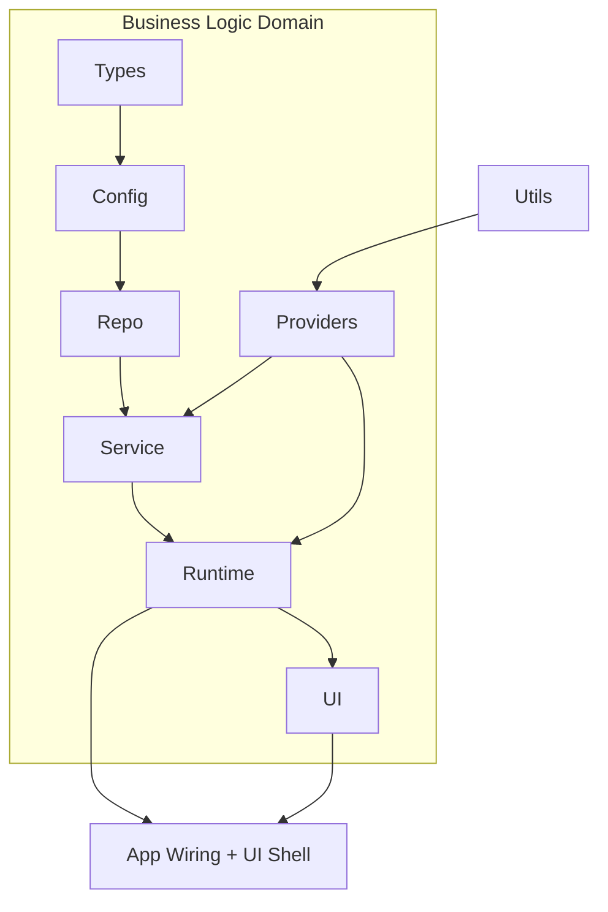

# Domain and Layer Map

Last reviewed: 2026-02-12
Status: active

This document defines the fixed architectural layers and domain boundaries for an agent-readable codebase.

## Layer Rule

Canonical flow inside each business domain:

`Types -> Config -> Repo -> Service -> Runtime -> UI`

Cross-cutting concerns enter only through explicit providers.

`Utils` is allowed as pure helper code with zero business side effects.

## High-Level Map

## Domain Catalog

| Domain | Mission | Primary packages |
|---|---|---|
| Curriculum Content | Guarantee CEFR/TBLT progression and session integrity | `learning/content`, `learning/syllabus`, `learning/weeks` |
| Prompt and Resources | Resolve instructional assets and references | `learning/prompts`, `learning/resources` |
| Session Runtime | Execute gated daily sessions with recovery/resume | `app/web/js/core`, `app/web/js/routing` |
| Navigation Shell | Provide deterministic route-driven UX | `app/web/js/routing`, `app/web/js/ui` |
| Progress and Measurement | Compute metrics and persistent state | `app/web/js/domain`, `app/web/js/state`, `tracking/state` |
| Governance and Quality | Validate architecture, content, and docs in CI | `scripts`, `.github/workflows`, `docs/architecture` |

## Allowed Dependencies by Layer

| Layer | Can depend on |
|---|---|
| Types | `Utils` |
| Config | `Types`, `Utils` |
| Repo | `Config`, `Types`, `Utils` |
| Service | `Repo`, `Config`, `Types`, `Providers`, `Utils` |
| Runtime | `Service`, `Repo`, `Config`, `Types`, `Providers`, `Utils` |
| UI | `Runtime`, `Service`, `Types`, `Utils` |
| Providers | `Config`, `Types`, `Utils` |

Forbidden examples:

- `UI -> Repo` direct data loading.
- `Runtime -> UI` imports.
- `Service -> UI` imports.

## Package Roots

| Path | Domain | Layer | Notes |
|---|---|---|---|
| `app/web/js/domain` | Progress and Measurement | Types | Domain invariants and defaults |
| `config` | Governance and Quality | Config | Runtime configuration files |
| `app/web/js/content` | Curriculum Content | Repo | Content repository and loaders |
| `learning/content` | Curriculum Content | Repo | Week/day canonical data |
| `learning/syllabus` | Curriculum Content | Repo | 0->B2 blueprint data |
| `learning/prompts` | Prompt and Resources | Repo | Prompt packs and references |
| `learning/resources` | Prompt and Resources | Repo | Resource catalog |
| `app/web/js/core/runtime_flow.js` | Session Runtime | Service | Journey state derivation and guards |
| `app/web/js/core/metrics_engine.js` | Progress and Measurement | Service | Metrics computation |
| `app/web/js/core/orchestrator.js` | Session Runtime | Runtime | Session lifecycle engine |
| `app/web/js/core/bootstrap_v4.js` | Navigation Shell | Runtime | App wiring and route orchestration |
| `app/web/js/routing` | Navigation Shell | Providers | Router and canonical route provider |
| `app/web/js/core/telemetry_sink.js` | Governance and Quality | Providers | Runtime telemetry provider |
| `app/web/js/state` | Progress and Measurement | Repo | Local persistence adapters |
| `app/web/js/ui` | Navigation Shell | UI | View shell and wizard UI |
| `app/web/css` | Navigation Shell | UI | Design system and styling |
| `tracking/state` | Progress and Measurement | Repo | Persisted adaptive history |
| `scripts` | Governance and Quality | Service | Validators, linters, audits |
| `.github/workflows` | Governance and Quality | Runtime | CI policy enforcement |
| `docs/architecture` | Governance and Quality | Types | Architecture knowledge base |

## Known Boundary Gaps

- Some runtime files still hold mixed responsibilities (`Runtime + Providers`) and should be split in future refactors.
- Dependency directions are currently validated by docs linters and conventions; a JS import boundary linter is still pending.

See `docs/architecture/plans/debt/TECH_DEBT_REGISTER.md` for tracked debt IDs.
