# Diagramas de Arquitectura
## Hybrid Executable V4 - Zero Friction English (A1/A2 -> B2)

Estado: Propuesto  
Version: 1.0  
Formato: Mermaid (Markdown)

---

## 1) Contexto del Sistema (C4 - Nivel Contexto)

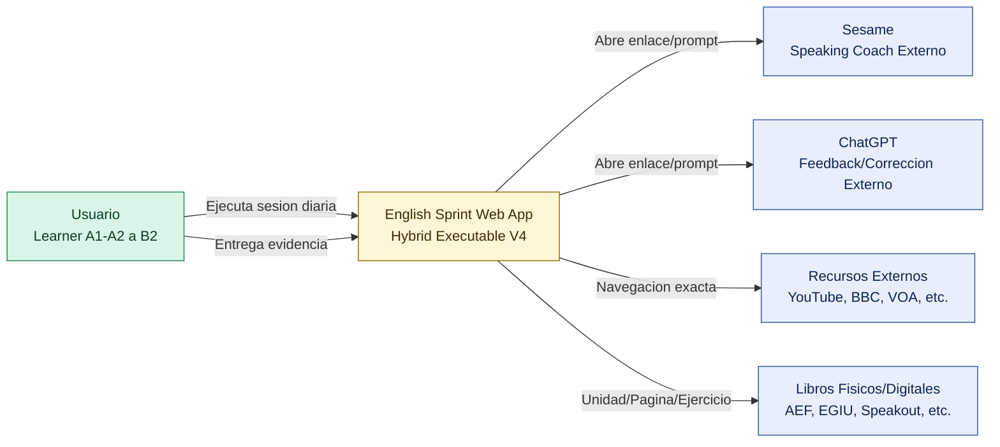

---

## 2) Contenedores y Fronteras (C4 - Nivel Contenedor)

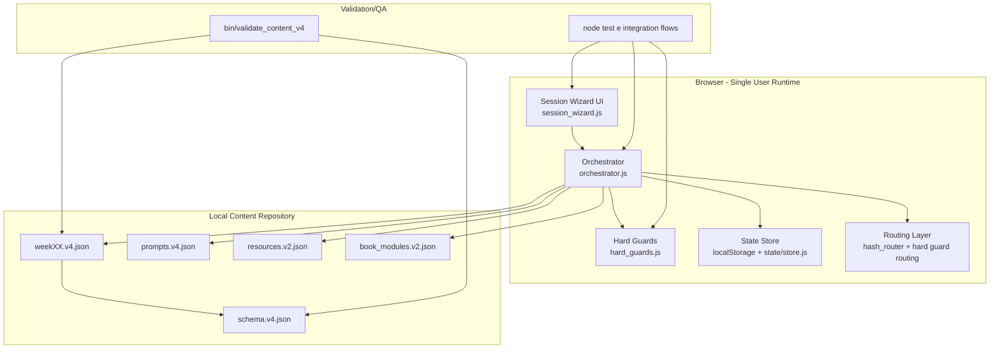

---

## 3) Componentes Internos y Responsabilidades

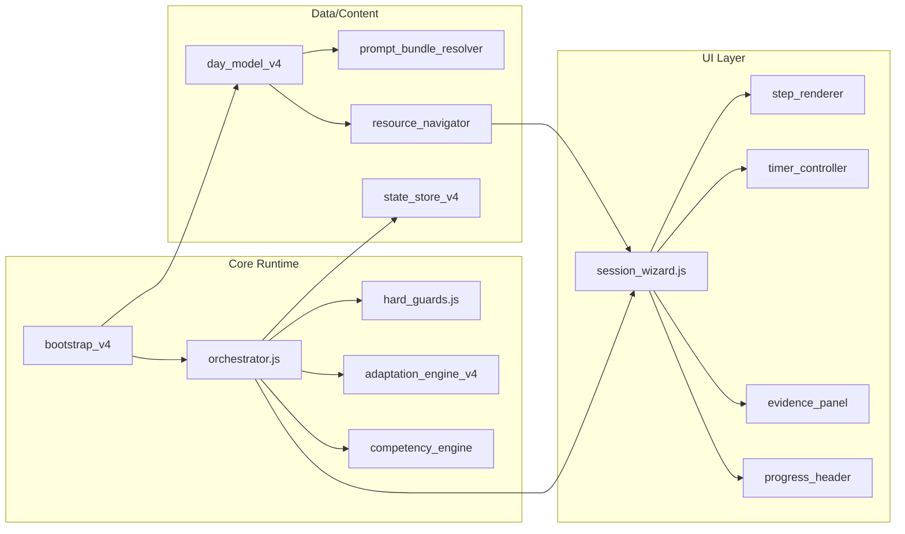

---

## 4) Flujo de Ejecucion de una Sesion (2h / 5h)

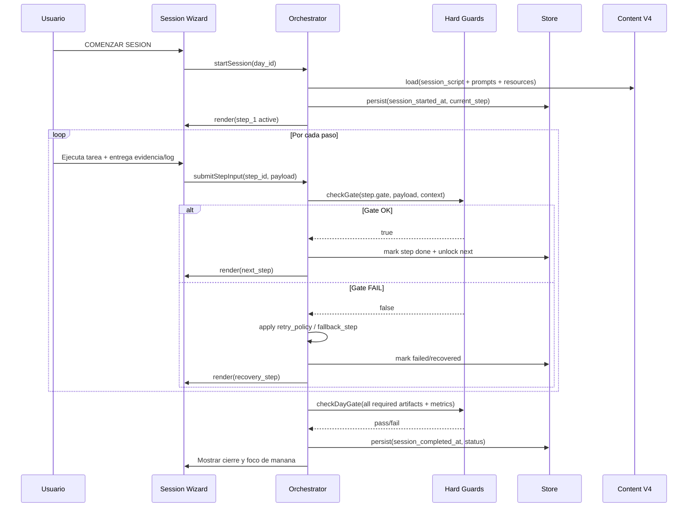

---

## 5) Maquina de Estados del Paso

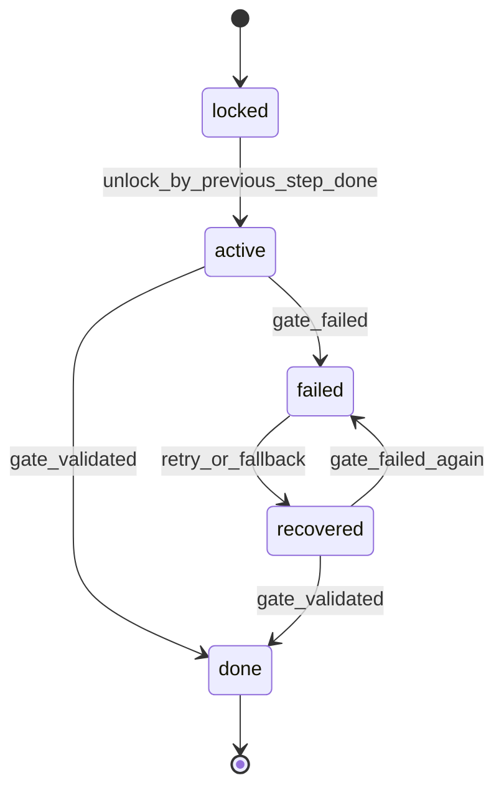

---

## 6) Maquina de Estados de la Sesion

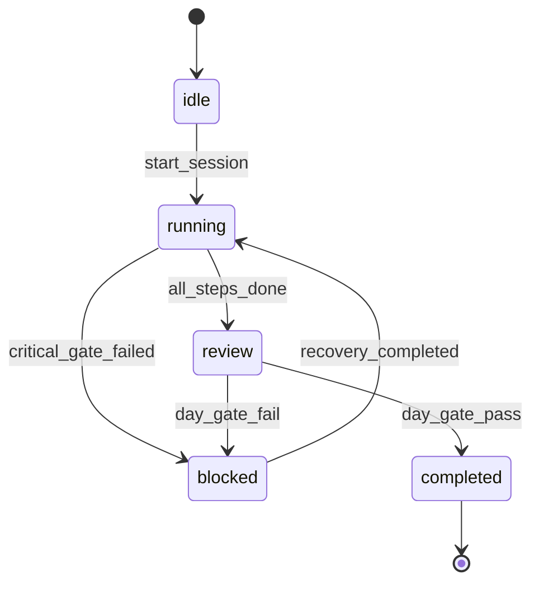

---

## 7) Modelo de Datos V4 (Relaciones Clave)

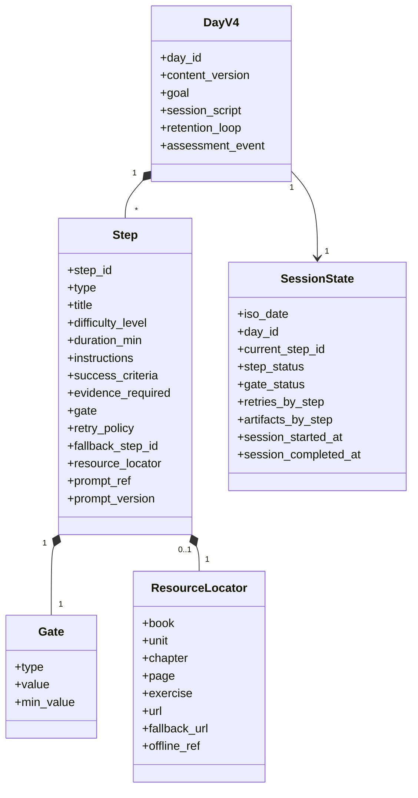

---

## 8) Flujo de Hard Gates (Decision Tree)

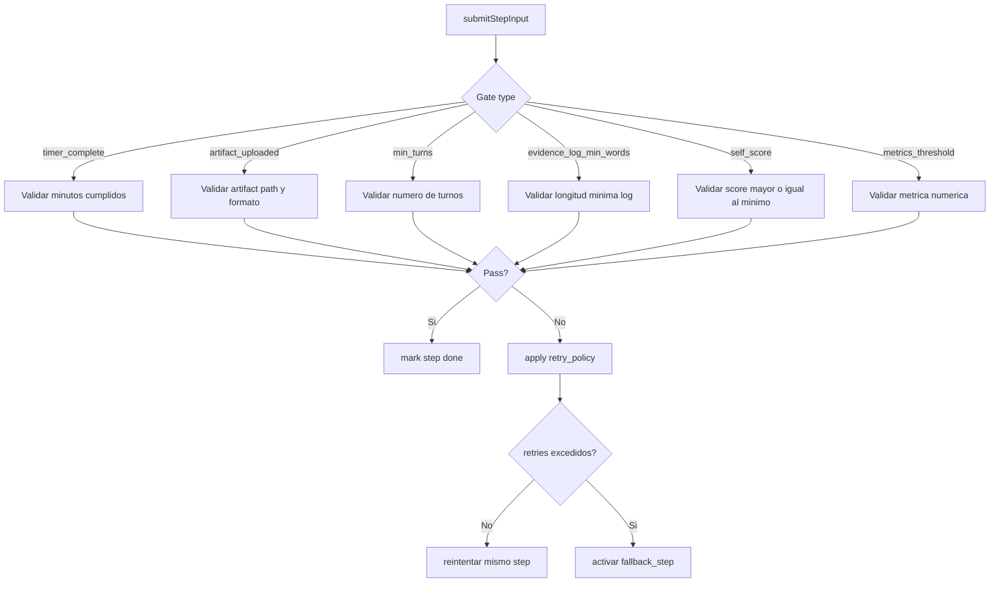

---

## 9) Pipeline de Validacion de Contenido V4

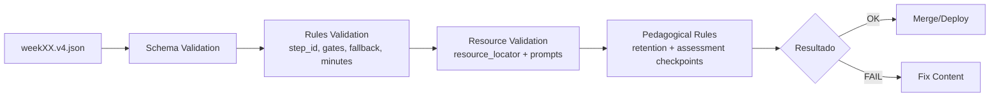

---

## 10) Plan de Migracion V3 -> V4 (Arquitectura de Transicion)

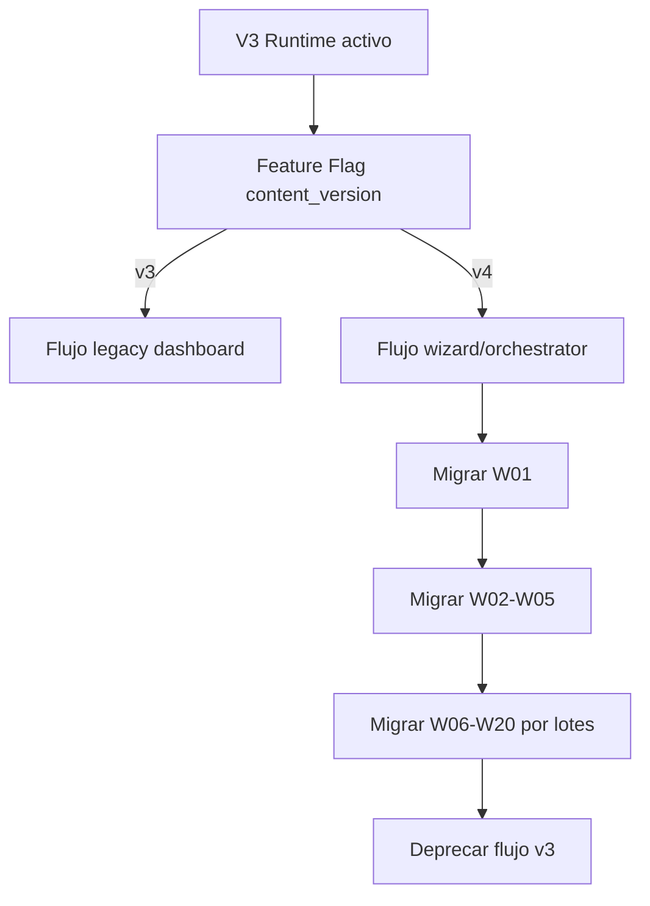

---

## 11) Vista de Modulo Diario (Design Blueprint)

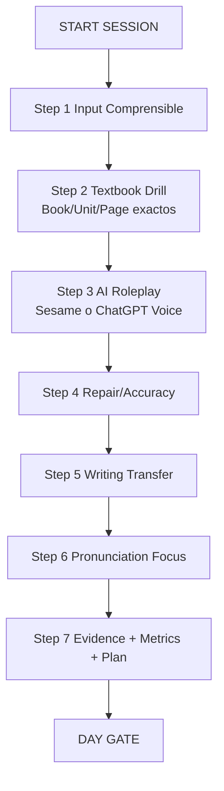

---

## 12) Reglas de Diseno UX (Resumen)

1. Una accion dominante por pantalla.
2. Boton "Siguiente" siempre bloqueado hasta gate valido.
3. Instrucciones en modo imperativo, sin ambiguedad.
4. Siempre mostrar:
- Que hacer ahora
- Como hacerlo
- Cuanto tiempo
- Como se valida

---

## 13) Leyenda de Tipos de Step (V4)

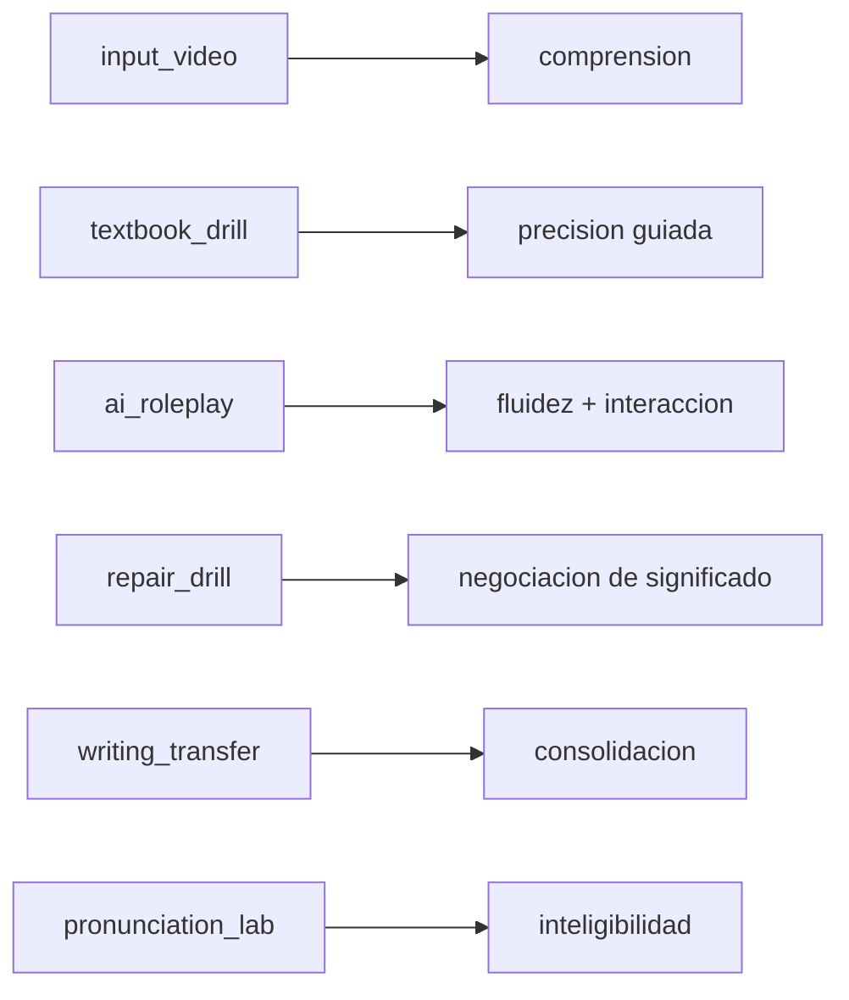

---

## 14) Resultado Esperado de Arquitectura

1. El usuario nunca queda perdido.
2. El sistema fuerza evidencia real antes de avanzar.
3. La progresion curricular deja de ser una lista y pasa a ser una ejecucion guiada.
4. El control de calidad del contenido queda automatizado en validadores.
