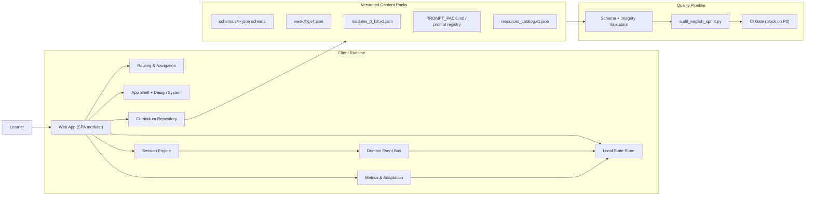
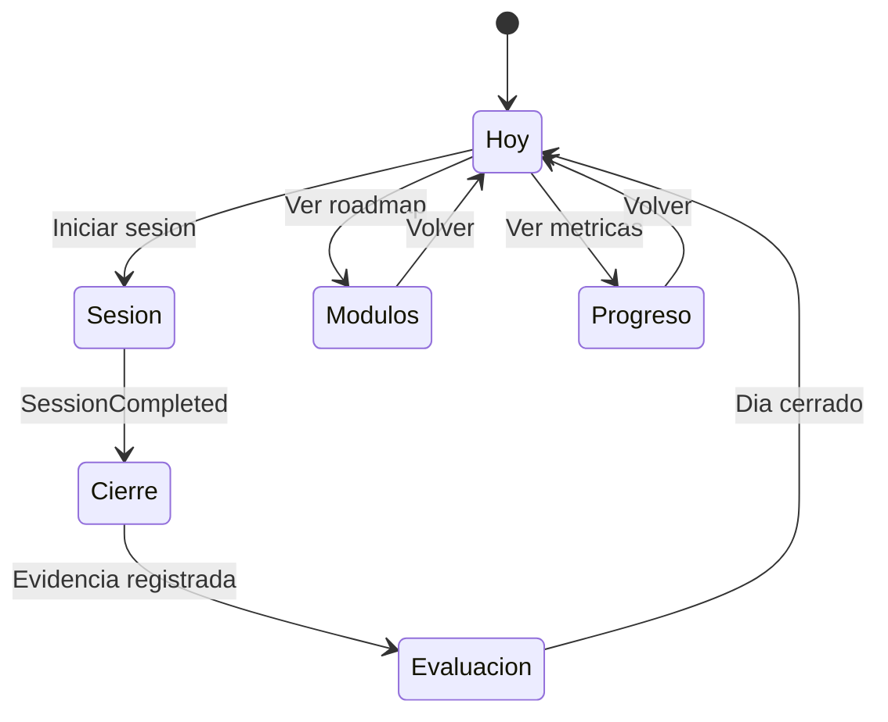
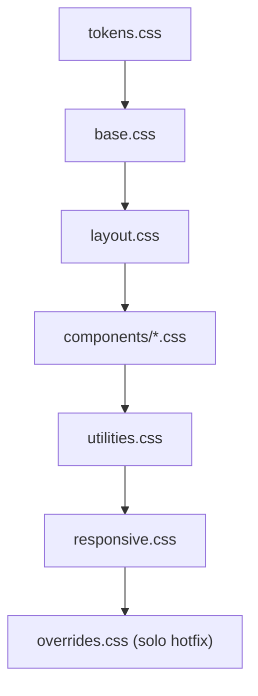
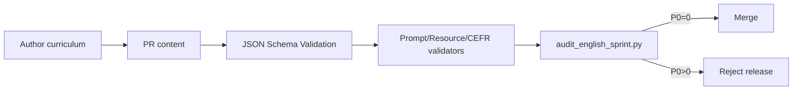

# English Sprint - System Design 0->B2 (V1)

Estado: propuesta de arquitectura objetivo para ejecutar refactor y estabilizacion.
Scope: curriculum V4+, frontend web, data contracts, runtime de sesion y observabilidad.

## 1) Principios de arquitectura

1. Unica fuente de verdad para contenido y progreso.
2. Frontend modular por bounded contexts, no por pantallas sueltas.
3. Contratos versionados y validados en CI antes de publicar.
4. Navegacion canonica y deterministic routing (sin aliases ambiguos en runtime).
5. Runtime de sesion resiliente: recuperable, idempotente y auditable.
6. UX data-driven: nada hardcoded en KPIs, progreso o gamificacion.
7. Escalabilidad evolutiva: local-first hoy, backend-ready sin reescribir dominio.

## 2) Objetivos no funcionales (NFR)

- Disponibilidad UX: app usable offline para sesiones ya descargadas.
- Integridad de progreso: cero perdida de estado ante refresh/cierre.
- Rendimiento:
  - TTI dashboard < 2.5s (desktop medio).
  - Cambio de vista < 120ms p95.
  - Submit de gate < 80ms p95 local.
- Mantenibilidad:
  - Todo contrato versionado (`schema/content/prompts/resources/state`).
  - Cobertura de tests core >= 85% en dominio/routing/guards.
- Observabilidad:
  - Event log por `session_id`, `day_id`, `step_id`, `gate_type`.
  - Auditoria de curriculum antes de release (P0=0 obligatorio).

## 3) Visualizador adoptado

Se usa Mermaid en Markdown (versionable, code-review friendly, portable). Luego puede exportarse a draw.io si se necesita edicion visual colaborativa.

## 4) Arquitectura objetivo (C4 - Container)



## 5) Bounded contexts y modulos

### 5.1 Curriculum Context
Responsable: plan pedagogico y progresion CEFR.

- Inputs: `learning/content/week*.v4.json`, `learning/content/schema.v4.json`, `learning/syllabus/modules_0_b2.v1.json`.
- Salidas: `WeekPlan`, `DayPlan`, `StepPlan` normalizados.
- Reglas criticas:
  - `week_profile.cefr_target` alineado con `step.difficulty_level`.
  - `session_script` no vacio en ningun dia.
  - `assessment_event=true` en hitos (W01/W05/W10/W15/W20).

### 5.2 Prompt & Resource Context
Responsable: integridad de referencias instruccionales.

- Inputs: `prompt_ref`, `resource_locator` en steps.
- Source registries: `learning/prompts/PROMPT_PACK.md`, `learning/resources/resources_catalog.v1.json`.
- Regla: todo `prompt_ref` y `resource_locator` debe resolver o bloquear release.

### 5.3 Session Runtime Context
Responsable: ejecucion guiada diaria con gates.

- Componentes actuales base:
  - `app/web/js/core/orchestrator.js`
  - `app/web/js/ui/session_wizard.js`
  - `app/web/js/routing/hard_guards.js`
- Contrato runtime:
  - `init(dayContent)`
  - `submitStep(stepId, input)`
  - `getProgress()`
- Garantias:
  - Estado idempotente por `day_id`.
  - Reintentos y fallback_step controlados por politica.

### 5.4 Progress & Metrics Context
Responsable: score longitudinal, KPI y adaptacion.

- Motor base: `app/web/js/core/metrics_engine.js`.
- Estado: `app/web/js/state/store.js` + storage adapter.
- Resultado:
  - `progress_snapshot`
  - `weekly_kpi`
  - `adaptation_signal`

### 5.5 Shell & Navigation Context
Responsable: arquitectura UI y continuidad de flujo.

- Shell actual base: `app/web/js/ui/learning_shell.js`, `app/web/js/ui/views.js`.
- Router base: `app/web/js/routing/*.js`.
- Regla objetivo: una sola tabla canonica de rutas compartida entre shell y router.

### 5.6 Design System Context
Responsable: consistencia visual/UX accesible.

- Tokens: `app/web/css/tokens.css`.
- Entry points CSS (problema actual): `app/web/styles.css` y `app/web/css/index.css`.
- Regla objetivo: entrypoint unico + capas CSS gobernadas.

### 5.7 Quality & Governance Context
Responsable: calidad de release.

- Scripts: `audit_english_sprint.py`, validadores schema.
- Politica release:
  - P0=0 obligatorio.
  - P1 aceptable solo con waivers explicitos.

## 6) Navegacion canonica (respetando flujo producto)

Flujo oficial de aprendizaje:
1. `Hoy`
2. `Sesion`
3. `Cierre`
4. `Evaluacion`
5. `Modulos`
6. `Progreso`

### 6.1 Mapa de estados de navegacion



### 6.2 Contrato de rutas (target)

```text
#/modulo/hoy
#/modulo/sesion
#/modulo/cierre
#/modulo/evaluacion
#/modulo/modulos
#/modulo/progreso
```

Compatibilidad legacy:
- Mantener aliases antiguos solo por una release de transicion y redireccionar a canonico.
- Remover aliases despues de migrar links internos y tests.

## 7) Design System profesional (v1)

## 7.1 Foundations

- Color tokens: mantener semanticos (`--surface-*`, `--text-*`, `--action-*`, `--status-*`).
- Tipografia:
  - Display: `Space Grotesk`
  - Body: `DM Sans`
  - Mono: `IBM Plex Mono`
- Escala espacial: 4/8/12/16/24/32/48.
- Radios: `sm/md/lg/xl/pill`.
- Elevacion: `sm/md/lg/xl`.
- Motion: `fast(160ms)` y `standard(280ms)`.

## 7.2 CSS architecture target



Reglas:
- Un unico entrypoint (`app/web/css/index.css`).
- `app/web/styles.css` pasa a alias temporal y luego se elimina.
- Sin utilidades no soportadas por framework inexistente (e.g. `lg:*`, `md:*` inline).

## 7.3 Component inventory (obligatorio)

1. `AppShell`
2. `TopHeader`
3. `NavRail` + `MobileBottomNav`
4. `TodayCard` (dinamica)
5. `SessionWizard`
6. `ModuleTimeline`
7. `ProgressWidgets`
8. `MetricCard`
9. `GateStatusBadge`
10. `ErrorBoundary/FatalCard`

Cada componente debe definir:
- props contrato.
- estados (`loading`, `empty`, `ready`, `error`).
- eventos UI y telemetria.

## 7.4 Accessibility baseline

- WCAG AA contraste minimo.
- Focus visible en todos los controles.
- Navegacion teclado completa para `Sesion`.
- `aria-live` en estados criticos (gate failed/completed).
- Safe area en mobile nav para evitar overlap de contenido.

## 8) Data contract target (V5-ready)

## 8.1 Entidades core

- `ProgramConfig`
- `WeekPlan`
- `DayPlan`
- `SessionStep`
- `PromptDefinition`
- `ResourceReference`
- `ProgressSnapshot`
- `MetricSeries`
- `AdaptationDecision`

## 8.2 Reglas de integridad fuertes

1. `SessionStep.type` debe pertenecer a enum de schema.
2. `difficulty_level` no puede estar debajo del `cefr_target` del modulo.
3. `resource_locator.page` obligatorio cuando se declara `resource_locator`.
4. `prompt_ref` debe existir en registry versionado.
5. `retention_loop` minimo 2 dias por semana desde W03.
6. `assessment_event=true` en semanas hito.

## 8.3 Lifecycle de contenido (publish pipeline)



## 9) Plan pedagogico modulo por modulo (A0->B2)

Objetivo: cada modulo con contratos de contenido, mix metodologico y gates claros.

## 9.1 M00 (W01-W02) - A0->A1
- Outcome: supervivencia oral y seguridad inicial.
- Mix minimo por semana:
  - `input_video` x2
  - `textbook_drill` x2
  - `ai_roleplay` x2
  - `pronunciation_lab` x1
  - `recording_task` x1
- Gate semanal: presentacion guiada 2 min + intelligibility baseline.

## 9.2 M01 (W03-W05) - A1->A2
- Outcome: transacciones funcionales diarias.
- Mix minimo:
  - `reading_task` x1
  - `writing_transfer` x2
  - `ai_roleplay` x3
  - `repair_drill` x1
- Gate semanal: tarea funcional completa (inicio-medio-cierre).

## 9.3 M02 (W06-W10) - A2+->B1
- Outcome: interaccion sostenida 12-15 min.
- Mix minimo:
  - `ai_roleplay` x3
  - `quiz` x1
  - `recording_task` x1
  - `repair_drill` x1
  - `pronunciation_lab` x1
- Gate semanal: negotiation-of-meaning con repair_success >= 70%.

## 9.4 M03 (W11-W15) - B1->B1+
- Outcome: precision sin romper fluidez.
- Mix minimo:
  - `writing_transfer` x2
  - `repair_drill` x2
  - `ai_roleplay` x2
  - `reading_task` x1
- Gate semanal: error_density trend descendente + rubric >= umbral.

## 9.5 M04 (W16-W18) - B1+->B2
- Outcome: argumentacion y complejidad discursiva.
- Mix minimo:
  - `ai_roleplay` x3
  - `reading_task` x1
  - `recording_task` x1
  - `writing_transfer` x2
- Regla critica: `difficulty_level >= B2` en pasos productivos.
- Gate semanal: mock parcial B2 con cohesion y contraargumento.

## 9.6 M05 (W19-W20) - B2 Performance
- Outcome: desempeno estable general + tecnico.
- Mix minimo:
  - simulacion entrevista
  - simulacion reunion
  - task de decision bajo presion
  - cierre reflexivo con evidencia
- Gate final: mock B2 25-30 min y KPI en rango objetivo.

## 10) Resiliencia y escalabilidad

## 10.1 Resiliencia (cliente)
- Persistencia transaccional por evento (`step_submitted`, `gate_passed`, `session_completed`).
- Rehidratacion segura al recargar (resume por `day_id` + `current_step_id`).
- Error boundaries por modulo (`Shell`, `SessionWizard`, `ContentLoader`).
- Modo degradado cuando falta recurso externo (usar `offline_ref`).

## 10.2 Escalabilidad (evolutiva)
- Fase actual: local-first (JSON + localStorage).
- Fase siguiente: BFF/API opcional para sync multi-dispositivo.
- Diseñar desde ahora puertos/adaptadores:
  - `ContentRepositoryPort`
  - `ProgressStorePort`
  - `TelemetrySinkPort`
  - `PromptResolverPort`

## 10.3 Observabilidad

Eventos minimos:
- `route_changed`
- `session_started`
- `step_started`
- `gate_passed`
- `gate_failed`
- `session_completed`
- `session_abandoned`
- `content_fallback_used`

## 11) Roadmap de ejecucion (sin implementar todavia)

### Fase 0 - Baseline de arquitectura (1 sprint)
- Unificar mapa de rutas y vistas (shell/router).
- Definir ADRs clave (routing, css entrypoint, contracts).
- Congelar contratos `v4.1`.

### Fase 1 - Data contract y curriculum (2 sprints)
- Corregir P0 de contenido (CEFR, placeholders, prompts, session_script vacio).
- Introducir validadores dedicados `prompt_ref` y `resource_locator`.
- Activar `--fail-on-p0` en CI obligatorio.

### Fase 2 - Frontend integration (2 sprints)
- Rewire completo de `LearningShell` a datos reales.
- Eliminar hardcoded stats/xp/rank.
- Canonicalizar CSS entrypoint y limpiar responsive stale selectors.

### Fase 3 - Runtime hardening (1 sprint)
- Fortalecer rehidratacion/resume.
- Agregar pruebas e2e del flujo `Hoy -> Sesion -> Cierre -> Evaluacion`.
- Telemetria estructurada.

### Fase 4 - Polish y release readiness (1 sprint)
- Accessibility pass AA.
- Performance budget y regression suite.
- Checklist go-live con quality gates en verde.

## 12) Definition of Done (DoD) para iniciar implementacion

1. Documento aprobado por producto + contenido + frontend.
2. Contrato de rutas canonicas firmado.
3. Contrato de datos versionado y validadores listos.
4. Mapa de componentes del design system cerrado.
5. Plan de migracion P0->P2 priorizado con owners.

---

## Anexo A - Matriz de responsabilidad por modulo

| Modulo | Owner primario | Artefactos | KPI de salida |
|---|---|---|---|
| Curriculum | Learning Architect | `learning/content/*.v4.json` | CEFR alignment 100% |
| Prompt/Resources | Content Ops | `PROMPT_PACK.md`, `resources_catalog.v1.json` | prompt resolution 100% |
| Session Runtime | Frontend Core | `orchestrator.js`, `session_wizard.js` | completion integrity 100% |
| Progress/Metrics | Data UX | `metrics_engine.js`, `state/store.js` | no hardcoded KPIs |
| Navigation Shell | Frontend UX | `learning_shell.js`, `routing/*.js` | 0 broken route transitions |
| Design System | UI Platform | `css/*` | single entrypoint + AA |
| Quality Pipeline | DevEx | `audit_english_sprint.py`, CI | P0=0 block enforced |

